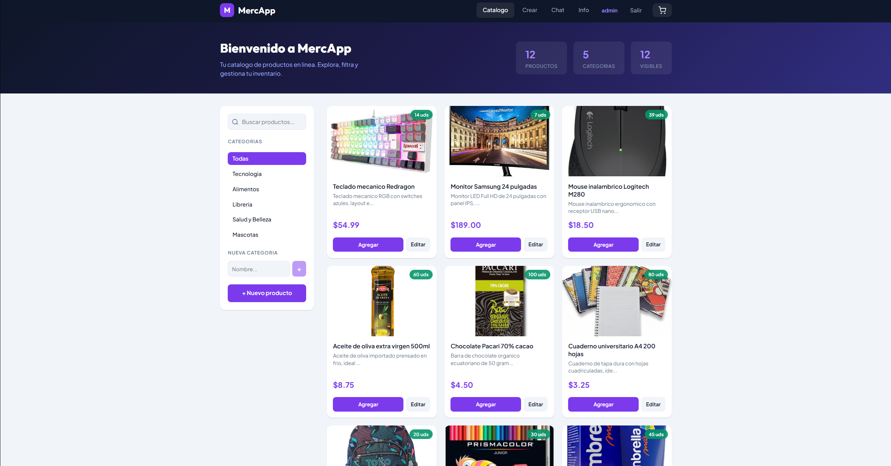
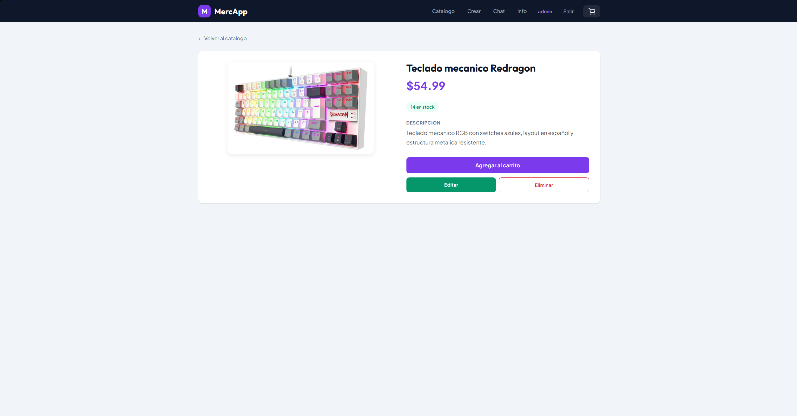
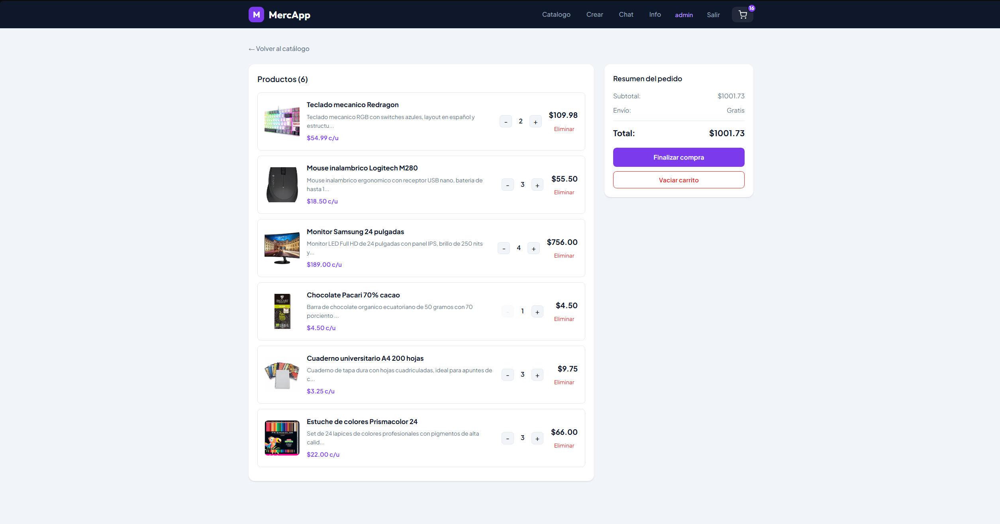
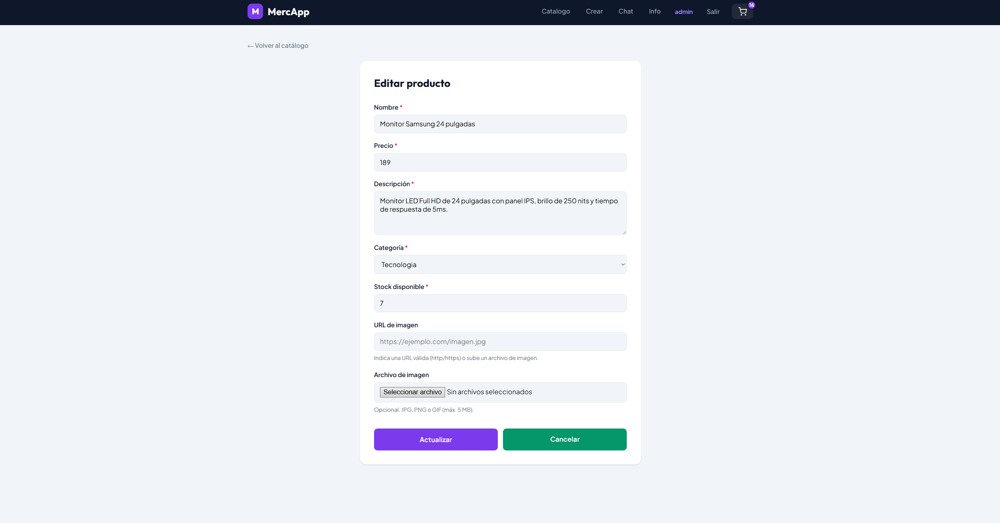

# MercApp

Aplicación web para gestión y venta de productos

**Estudiante:** Mateo Carranza  
**Carrera:** Ingeniería en Software  
**Materia:** Aplicaciones Web  
**Repositorio:** [github.com/wildmaster18/MercApp.git](https://github.com/wildmaster18/MercApp.git)

---

## Qué es MercApp

MercApp es una tienda en línea compuesta por dos partes que trabajan juntas. La primera es una API REST hecha con Node.js, Express y MongoDB que almacena los productos, categorías y usuarios. La segunda es una SPA (Single Page Application) hecha con Vue 3 que se conecta a esa API y presenta toda la interfaz al usuario sin recargar la página.

El backend conserva también las vistas Handlebars de la Unidad 2 (login, productos, chat) accesibles desde el puerto 3000, mientras que la SPA Vue corre en el puerto 5173 durante el desarrollo.

---

## Cómo ejecutar el proyecto

### Requisitos

Se necesita tener instalado Node.js v18+ y MongoDB.

### Backend

```
cd backend
npm install
npm run seed
npm run dev
```

El seed crea 5 categorías, 12 productos y un usuario de prueba. El servidor queda disponible en `http://localhost:3000`.

**Credenciales de prueba:** usuario `admin`, contraseña `admin`.

El archivo `.env` es opcional porque el código tiene valores por defecto. Si se quiere personalizar, crear un archivo `.env` en la carpeta backend con:

```
PORT=3000
MONGODB_URI=mongodb://127.0.0.1:27017/mercapp
SESSION_SECRET=claveSecretaMercApp2026
FRONTEND_URL=http://localhost:5173
```

### Frontend

En otra terminal:

```
cd frontend
npm install
npm run dev
```

Abrir `http://localhost:5173` en el navegador. La app redirige al login. Ingresar con `admin / admin`.

---

## Rutas de la API

| Método | Ruta               | Descripción                      |
| ------ | ------------------ | -------------------------------- |
| GET    | /api/products      | Lista todos los productos        |
| GET    | /api/products/:id  | Obtiene un producto por su ID    |
| POST   | /api/products      | Crea un producto nuevo           |
| PUT    | /api/products/:id  | Actualiza un producto completo   |
| PATCH  | /api/products/:id  | Actualiza campos parciales       |
| DELETE | /api/products/:id  | Elimina un producto              |
| GET    | /api/categories    | Lista las categorías             |
| POST   | /api/categories    | Crea una categoría nueva         |
| POST   | /api/checkout      | Procesa compra y descuenta stock |
| POST   | /api/auth/register | Registra un usuario nuevo        |
| POST   | /api/auth/login    | Inicia sesión                    |
| POST   | /api/auth/logout   | Cierra sesión                    |
| GET    | /api/auth/me       | Devuelve el usuario autenticado  |

Todas las rutas de productos validan los datos con express-validator. Los errores devuelven códigos 400 (validación), 404 (no encontrado) o 500 (servidor).

---

## Rutas del frontend (Vue Router)

| Ruta              | Vista                    | Carga  |
| ----------------- | ------------------------ | ------ |
| /                 | Catálogo de productos    | Normal |
| /login            | Inicio de sesión         | Lazy   |
| /register         | Registro de usuario      | Lazy   |
| /chat             | Chat en tiempo real      | Lazy   |
| /product/new      | Formulario de creación   | Normal |
| /product/:id      | Detalle del producto     | Normal |
| /product/:id/edit | Formulario de edición    | Normal |
| /cart             | Carrito de compras       | Lazy   |
| /about            | Información del proyecto | Lazy   |
| /\*               | Página 404               | Lazy   |

Las rutas marcadas como Lazy se cargan bajo demanda con `() => import(...)`. La app usa `<Suspense>` en el componente raíz con un fallback de carga mientras se resuelven.

Un guard de navegación protege todas las rutas excepto `/login` y `/register`, redirigiendo a la pantalla de inicio de sesión si no hay usuario autenticado.

---

## Stack tecnológico

### Backend

| Tecnología        | Versión | Uso                     |
| ----------------- | ------- | ----------------------- |
| Node.js           | v18+    | Entorno de ejecución    |
| Express           | 5.2.1   | Framework HTTP          |
| MongoDB           | v6+     | Base de datos           |
| Mongoose          | 9.6.2   | ODM para MongoDB        |
| express-validator | 7.3.2   | Validación de datos     |
| Multer            | 2.1.1   | Carga de imágenes       |
| bcrypt            | 6.0.0   | Hash de contraseñas     |
| express-session   | 1.19.0  | Sesiones de usuario     |
| Socket.io         | 4.8.3   | Chat en tiempo real     |
| cors              | 2.8.6   | Peticiones cross-origin |
| dotenv            | 17.4.2  | Variables de entorno    |
| nodemon           | 3.1.10  | Recarga en desarrollo   |

### Frontend

| Tecnología       | Versión | Uso                                  |
| ---------------- | ------- | ------------------------------------ |
| Vue 3            | 3.5.34  | Framework reactivo (Composition API) |
| Vue Router       | 5.0.7   | Navegación SPA                       |
| Pinia            | 3.0+    | Estado global del carrito            |
| Vite             | 8.0.13  | Bundler y servidor de desarrollo     |
| socket.io-client | 4.8.3   | Chat desde la SPA                    |

---

## Estructura de carpetas

```
MercApp/
├── backend/
│   ├── config/            database.js, multer.js
│   ├── controllers/       authController.js, productoController.js
│   ├── middlewares/        verificarSesion.js
│   ├── models/            Producto.js, Categoria.js, Usuario.js
│   ├── public/            css/, js/chat.js, images/default.jpg
│   ├── routes/            api.js, authRoutes.js, chatRoutes.js, prodRoutes.js
│   ├── uploads/           (imágenes subidas por el usuario)
│   ├── views/             (plantillas Handlebars de la Unidad 2)
│   ├── app.js             Servidor principal
│   ├── seed.js            Datos iniciales
│   └── .env.example
├── frontend/
│   └── src/
│       ├── components/    NavBar, ProductCard, CartItem, LoadingFallback
│       ├── composables/   useFetch, useProducts, useCart (Pinia)
│       ├── router/        index.js con guard de autenticación
│       ├── views/         Home, ProductoDetalle, ProductoForm, CarritoView,
│       │                  LoginView, RegistroView, ChatView, AboutView, NotFoundView
│       ├── App.vue        Componente raíz con Suspense
│       ├── main.js        Registra Vue, Pinia y Router
│       └── style.css      Variables CSS globales
├── docs/screenshots/      Capturas de pantalla
├── readme.txt             URL del repositorio
└── README.md
```

---

## Qué se implementó

### API y modelos de datos (Tareas 1-3)

El backend expone 13 endpoints RESTful. Los modelos Producto (nombre, precio, descripcion, imagen, stock, categoryId) y Categoria (idCat, nombre) se definen con Mongoose. El seed puebla la base con 12 productos en 5 categorías y un usuario admin.

### Proyecto Vue 3 con Vite (Tarea 4)

El frontend se creó con Vite y usa SFCs (Single File Components) con la Composition API. El alias `@` apunta a `src/` y Vite tiene un proxy configurado para redirigir `/api` y `/uploads` al backend.

### Navegación SPA (Tarea 5)

Vue Router maneja 10 rutas incluyendo rutas dinámicas (`/product/:id`, `/product/:id/edit`) y una ruta catch-all para el 404.

### Búsqueda y filtros reactivos (Tarea 6)

La vista Home consume `GET /api/products` y `GET /api/categories`. Un `computed` llamado `productosFiltrados` aplica simultáneamente el texto del buscador y la categoría seleccionada sobre la lista de productos.

### Componentes reutilizables (Tarea 7)

`ProductCard` recibe un prop `product` y emite el evento `added-to-cart`. `CartItem` recibe un prop `item` y emite `increment`, `decrement` y `remove`. Ambos se usan con `v-for` en sus vistas padre.

### Composables (Tarea 8)

`useFetch` es genérico: maneja `data`, `loading` y `error` con reintento automático y cancelación real mediante `AbortController`. `useProducts` lo consume internamente y expone funciones específicas como `fetchProducts`, `fetchProductById`, `createProduct`, `updateProduct` y `deleteProduct`.

### Formularios con validación (Tarea 9)

`ProductoForm` funciona tanto para crear (`/product/new`) como para editar (`/product/:id/edit`). Usa 6 bindings `v-model` y valida cada campo con `@blur`. El backend también valida con express-validator para evitar datos inválidos desde Postman u otros clientes.

### Lazy loading y Suspense (Tarea 10)

6 vistas se cargan de forma diferida con `() => import(...)` en el router. El componente raíz `App.vue` envuelve el `<router-view>` en `<Suspense>` con `LoadingFallback` como fallback.

### Carrito con Pinia (Tarea 11)

El estado del carrito se gestiona con un store de Pinia (`defineStore`). Soporta agregar, quitar, modificar cantidades, calcular el total con `computed`, persistir en `localStorage` con un `watch` profundo y descontar stock en MongoDB al finalizar la compra mediante `POST /api/checkout`.

### Documentación (Tarea 12)

Este README, el archivo `readme.txt` con la URL del repositorio, el `.env.example` y las capturas de pantalla en `docs/screenshots/`.

---

## Capturas de pantalla

### Catálogo



### Detalle de producto



### Carrito de compras



### Formulario de producto



---

## Comandos útiles

**Backend:**

| Comando        | Descripción             |
| -------------- | ----------------------- |
| `npm install`  | Instala dependencias    |
| `npm run dev`  | Inicia con nodemon      |
| `npm start`    | Inicia con node         |
| `npm run seed` | Puebla la base de datos |

**Frontend:**

| Comando         | Descripción                |
| --------------- | -------------------------- |
| `npm install`   | Instala dependencias       |
| `npm run dev`   | Inicia con Vite            |
| `npm run build` | Genera build de producción |

---

## Problemas frecuentes

**MongoDB no conecta:** verificar que el servicio esté corriendo con `mongod` o revisar en Servicios de Windows que MongoDB Server esté activo.

**Frontend muestra error de conexión:** el backend debe estar corriendo en el puerto 3000 antes de abrir la SPA.

**Imágenes no cargan:** verificar que la carpeta `backend/uploads/` exista. Los productos del seed usan una imagen placeholder por defecto.

---

Proyecto desarrollado con fines académicos — Universidad Politécnica Salesiana, 2026.
